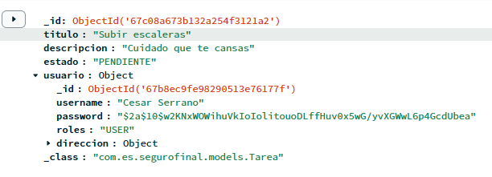
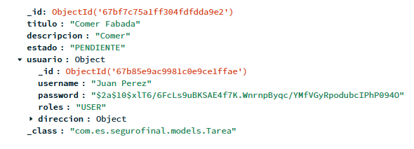
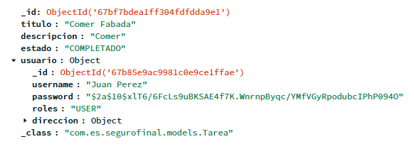

# API REST SEGURA CON MONGODB

### DESCRIPCIÓN BREVE
Esta es una implementación de una API REST segura usando de método de almacenamiento de datos un sistema **No Relacional** con MongoDB (documentos).

Es una aplicación sencilla en la que se gestionarán las tareas de casa. También, permitirá un registro de usuarios y un manejo de tareas que explicaré mas a detalle en adelante...

### DESCRIPCIÓN DETALLADA
Los documentos que compondrán esta aplicación son:
1. Usuarios
   1. username: String (nombre del usuario)
   2. password: String (contraseña del usuario)
   3. roles: Rol (Enum class con los roles: USER, ADMIN)
   4. direccion: Direccion (dirección del usuario)
   5. tareas: List<Tareas> (tareas que tiene el usuario)
2. Dirección
   1. calle: String (nombre de la calle)
   2. num: Int (número del hogar)
   3. provicia: String (provincia del usuario)
   4. municipio: String (municipio del usuario)
   5. cp: Int (código postal del usuario)
3. Tarea
   1. titulo: String (titulo de la tarea)
   2. descripcion: String (breve descripcion de la tarea)
   3. estado: String (estado de la tarea PENDIENTE/COMPLETADO)
   4. usuario: Usuario (usuario propietario de la tarea)

###  ENDPOINTS

#### Usuarios `/usuarios`
- **POST** `/register` -> Registra a un usuario en la base de datos.
- **POST** `/login` -> Inicia sesión.

#### Tareas `/tareas`
- **GET** `/show` -> Muestra todas las tareas.
- **GET** `/showTask` -> Muestra solo las tareas del usuario autenticado.
- **POST** `/create` -> Crea una nueva tarea.
- **PUT** `/update/{id}` -> Actualiza los datos de una tarea por su ID.
- **PUT** `/complete/{id}` -> Marca una tarea como completada.
- **DELETE** `/delete/{id}` -> Borra una tarea por su ID.

### EXCEPCIONES

 * 400 - BadRequestException: Indica que el servidor no puede cumplir con las solicitudes debido a un error por parte del cliente
 * 401 - UnauthorizedException: Indica que el So deniega el acceso debido a un error de seguridad
 * 403 - ForbiddenException: Indica que el usuario autenticado no tiene permisos para acceder al recurso solicitado.
 * 404 - NotFoundException: Indica que el recurso solicitado por el cliente no se encuentra en el servidor
 * 409 - ConflictException: Indica que la solicitud genera un conflicto con el estado actual del servidor, como intentar crear un recurso duplicado.

### RESTRICCIONES DE SEGURIDAD

Para "privar" a los usuarios de cualquier accion he decidido implementar un sistema de roles compuesto por dos tipos:
 * ADMIN (tiene acceso a ver, eliminar y dar de alta cualquier tarea de cualquier usuario)
 * USER (el resto de funciones que no sean las de admin)

Además, se utilizará cifrado asimétrico con clave pública y clave privada, junto con JWT (JSON Web Token), para el control de acceso.

#### Permisos

| Método  | Endpoint                | Roles Permitidos  | Descripción                                 |
|---------|-------------------------|-------------------|---------------------------------------------|
| **POST**   | `/usuario/login`        | Público           | Permite a cualquier usuario autenticarse.   |
| **POST**   | `/usuario/register`     | Público           | Permite a cualquier usuario registrarse.    |
| **GET**    | `/tareas/showTask`      | `USER`            | Muestra las tareas del usuario autenticado. |
| **GET**    | `/tareas/show`          | `ADMIN`           | Muestra todas las tareas (solo admins).     |
| **POST**   | `/tareas/create`        | `USER`, `ADMIN`   | Crea una nueva tarea.                       |
| **PUT**    | `/tareas/complete/{id}` | `USER`, `ADMIN`   | Marca una tarea como completada.            |
| **DELETE** | `/tareas/delete/{id}`   | `USER`, `ADMIN`   | Elimina una tarea.                          |

### PRUEBAS DE INSOMNIA

#### USUARIO

 * register (localhost:8081/usuario/register)
 
Esta es una imagen de un registro válido (USER)

Esta es la confirmación del registro válido previo

Esta es una imagen de un registro válido (ADMIN)

Esta es la confirmación del registro válido previo

Esta es una imagen con un registro inválido (municipio no encontrado)

Esta es una imagen con un registro inválido (campo vacio)

Esta es una imagen con un registro inválido (contraseñas desiguales)

 * login (localhost:8081/usuario/login)

Esta es una imagen de un login válido (USER)

Esta es una imagen de un login válido (ADMIN)

Esta es una imagen de un login inválido (usuario no encontrado)

Esta es una imagen de un login inválido (contraseña incorrecta)

#### TAREAS

* seeAllTasks (/tareas/show)
  
   Este endpoint muestra todas las tareas existentes de la base de datos y solo es accesible mediante los usuarios que tengan el rol **ADMIN**, de lo contrario te saltará un error 403 Forbidden que indica que no tienes permisos para acceder a este endpoint.

**Enunciado**: Usuario autenticado con rol **USER**

**Respuesta**: 403 Forbidden - Inicias sesion con un rol que no es admin

**Enunciado**: Usuario autenticado con rol **ADMIN**

**Respuesta**: 200 Ok - Muestra todas las tareas

**Enunciado**: Usuario no se ha autenticado

**Respuesta**: 401 Unauthorized - No se ha autenticado correctamente

* getMyTasks (/tareas/showTask)

   Este endpoint muestra las tareas propias del usuario logueado previamente, si tiene permisos de **USER** muestra todas sus tareas, si es **ADMIN** no te deja usar el endpoint.

**Enunciado**: Usuario autenticado con rol **USER**

**Respuesta**: 200 OK - Muestra todas las tareas propias

**Enunciado**: Usuario autenticado con rol **ADMIN**

**Respuesta**: 403 Forbidden - No tienes permisos para acceder al endpoint

* createTask (/tareas/create)

   Este endpoint crea una tarea introduciendole los campos de TareaDTO, si estás logueado como un usuario solo tienes acceso a crear tareas propias, si estás logueado como administrador puedes crear tareas a cualquier usuario con el id especificado (obviamente en el JSON)

**Enunciado**: Usuario autenticado con rol **ADMIN**

**Respuesta**: 201 Created - Crea la tarea con el id aportado

**Enunciado**: Usuario autenticado con rol **ADMIN**

**Respuesta**: 400 Bad Request - Los campos están vacíos

**Enunciado**: Usuario autenticado con rol **USER**

**Respuesta**: 201 Created - Crea la tarea

**Enunciado**: Usuario autenticado con rol **USER**

**Respuesta**: 401 Unauthorized - No puedes crear tareas a otro usuario

* updateTask (/tareas/update) -- No lo pide la rúbrica pero está hecho en código

* completeTask (/tareas/complete/{id})

**Enunciado**: Usuario autenticado con rol **USER**

**Respuesta**: 403 Forbidden - No puedes completar tareas a otro usuario

**Enunciado**: Usuario autenticado con rol **USER**

**Respuesta**: 200 OK - Tarea marcada como completada

Completar una tarea **USER** (Conflict)
**Enunciado**: Usuario autenticado con rol **USER**

**Respuesta**: 409 Conflict - No puedes completar una tarea ya completada

**Enunciado**: Usuario autenticado con rol **ADMIN**

**Respuesta**: 200 OK - Tarea marcada como completada

* deleteTask (/tareas/delete/{id})

**Enunciado**: Usuario autenticado con rol **ADMIN**

**Respuesta**: 204 No Content - Borra cualquier tarea

**Enunciado**: Usuario autenticado con rol **USER**

**Respuesta**: 403 Forbidden - No tienes permisos para borrar tareas de otros usuarios

**Enunciado**: Usuario autenticado con rol **ADMIN**

**Respuesta**: 204 No Content - Borra la tarea

### INTERFAZ

### SCREENSHOTS INICIALES

* Datos del Spring Initializr

* Colaborador Lainezz Añadido

* Base de datos creada en MongoDB
